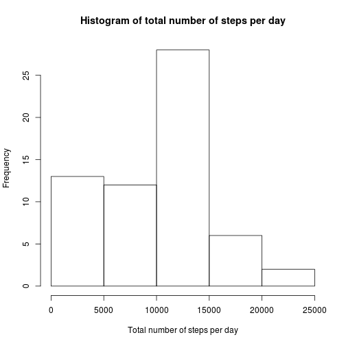
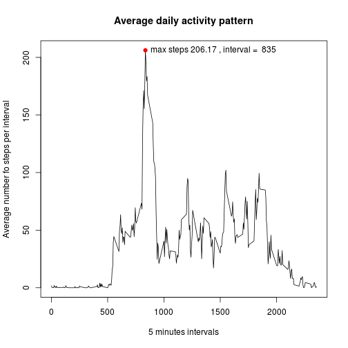
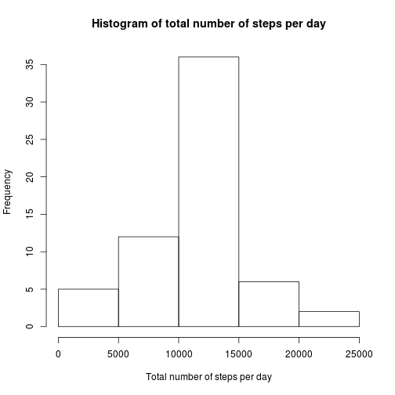
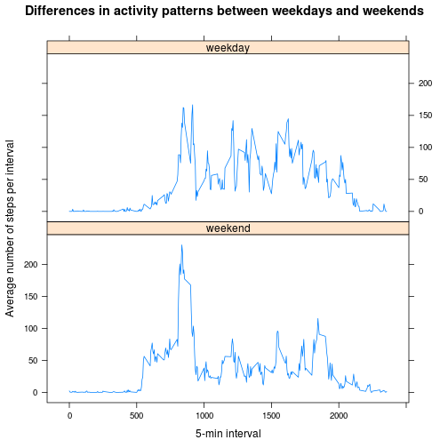

## Loading and preprocessing the data
It's supposed that Activity monitoring data archive `activity.zip` is in repository.
To ease further data manipulation load `dplyr` library.
In order to convert character dates `lubridate` package is used.


```r
library(dplyr)
library(lubridate)

unzip("activity.zip")
activity <- tbl_df(read.csv("activity.csv"))
activity <- mutate(activity, date=ymd(date))

head(activity)
```

```
## Source: local data frame [6 x 3]
## 
##   steps       date interval
## 1    NA 2012-10-01        0
## 2    NA 2012-10-01        5
## 3    NA 2012-10-01       10
## 4    NA 2012-10-01       15
## 5    NA 2012-10-01       20
## 6    NA 2012-10-01       25
```

```r
str(activity)
```

```
## Classes 'tbl_df', 'tbl' and 'data.frame':	17568 obs. of  3 variables:
##  $ steps   : int  NA NA NA NA NA NA NA NA NA NA ...
##  $ date    : POSIXct, format: "2012-10-01" "2012-10-01" ...
##  $ interval: int  0 5 10 15 20 25 30 35 40 45 ...
```

## What is mean total number of steps taken per day?


```r
total.steps.per.day <- activity %>%
    group_by(date) %>%
    summarize(steps=sum(steps, na.rm=TRUE))

hist(total.steps.per.day$steps,
    main="Histogram of total number of steps per day",
    xlab="Total number of steps per day")
```

 

```r
mean(total.steps.per.day$steps)
```

```
## [1] 9354.23
```

```r
median(total.steps.per.day$steps)
```

```
## [1] 10395
```

Mean total number of steps taken per day is **9354.23**.  
Median total number of steps taken per day is **10395**.

## What is the average daily activity pattern?


```r
avg.activity.pattern <- activity %>% group_by(interval) %>%
    summarise(avg.steps=mean(steps, na.rm=TRUE))
plot(avg.activity.pattern, type="l",
    main="Average daily activity pattern",
    xlab="5 minutes intervals",
    ylab="Average number fo steps per interval")

max.point <- avg.activity.pattern %>% filter(avg.steps == max(avg.steps))
points(max.point, pch=19, col="red")
text(max.point, labels=paste("max steps", round(max.point$avg.steps, digits=2),
                             ", interval = ", max.point$interval), pos=4)
```

 

The interval **835** contains maximum number of steps **206.17** across all intervals.


## Imputing missing values
The original dataset contains missing values.

```r
total.na <- sum(!complete.cases(activity))
```
Total number of missing values in dataset is **2304**.

All of the missing values in the dataset are replaced with the mean value of steps for particular interval.

```r
activity.complete <- activity %>%
    group_by(interval) %>%
    mutate(steps = ifelse(is.na(steps), mean(steps, na.rm=TRUE), steps)) %>%
    group_by(date)
head(activity.complete)
```

```
## Source: local data frame [6 x 3]
## Groups: date
## 
##       steps       date interval
## 1 1.7169811 2012-10-01        0
## 2 0.3396226 2012-10-01        5
## 3 0.1320755 2012-10-01       10
## 4 0.1509434 2012-10-01       15
## 5 0.0754717 2012-10-01       20
## 6 2.0943396 2012-10-01       25
```

```r
sum(!complete.cases(activity.complete))
```

```
## [1] 0
```

Histogram of the total number of steps taken per day.


```r
total.steps.per.day.complete <- activity.complete %>%
    group_by(date) %>%
    summarize(steps=sum(steps, na.rm=TRUE))

hist(total.steps.per.day.complete$steps,
    main="Histogram of total number of steps per day",
    xlab="Total number of steps per day")
```

 

```r
a <- mean(total.steps.per.day.complete$steps)
b <- median(total.steps.per.day.complete$steps)
```

From the above calculation it's easy to see that mean nde median values have changed after imputing missing data.  
Mean has changed from **9354.23** to **1.076619 &times; 10<sup>4</sup>**.  
Median has changed from **10395** to **1.076619 &times; 10<sup>4</sup>**.

As seen from the histograms imputing missing values normalizes data distribution.

## Are there differences in activity patterns between weekdays and weekends?

Dataset with imputed values is modified by adding factor column indicating type of the day ("weekday" or "weekend") in order to diffirentiate activity pattern by weekends and weekdays.


```r
day.type <- factor(wday(activity.complete$date) %in% c(1,7),
                   labels=c("weekend", "weekday"))
activity.day.type <- bind_cols(activity.complete, data.frame(day.type))
head(activity.day.type)
```

```
## Source: local data frame [6 x 4]
## 
##       steps       date interval day.type
## 1 1.7169811 2012-10-01        0  weekend
## 2 0.3396226 2012-10-01        5  weekend
## 3 0.1320755 2012-10-01       10  weekend
## 4 0.1509434 2012-10-01       15  weekend
## 5 0.0754717 2012-10-01       20  weekend
## 6 2.0943396 2012-10-01       25  weekend
```

Vizualization of activity patterns.

Below is a panel plot containing a time series plot of the 5-minute intervals and the average number of steps taken, averaged across all weekday days and weekend days.


```r
avg.activity <- activity.day.type %>%
    group_by(interval, day.type) %>%
    summarise(avg.steps=mean(steps))
    
library(lattice)
with(avg.activity,
     xyplot(avg.steps~interval|day.type, layout=c(1,2),
            type="l",
            main="Differences in activity patterns between weekdays and weekends",
            xlab="5-min interval",
            ylab="Average number of steps per interval"))
```

 

From the plot it clearly seen that activity on weekends is mostly concentrated in first half of the day in contrast to weekdays where it's spread across all the day.

